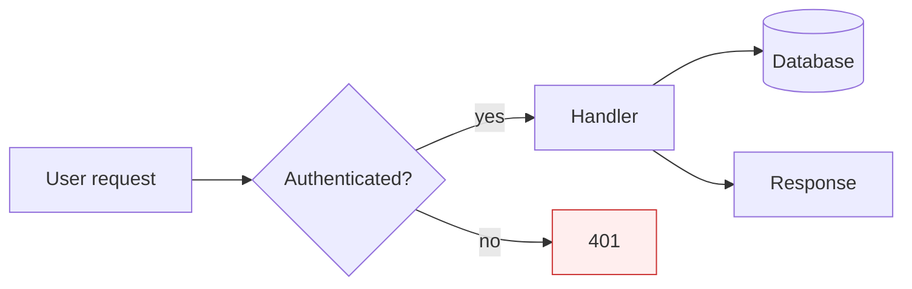

# Mermaid Diagrammer

Produce Mermaid diagrams that are readable, semantically correct, and render first time.

## Diagram type selection

| Intent | Type |
| --- | --- |
| Process / decisions | `flowchart` (LR/TD) |
| Message passing between actors | `sequenceDiagram` |
| Data model | `erDiagram` |
| Machine / lifecycle | `stateDiagram-v2` |
| Dependencies / system | `flowchart` with subgraphs |
| Schedule | `gantt` |
| User flow | `journey` |
| Class hierarchy | `classDiagram` |

## Approach

1. Clarify the diagram's purpose — what decision does it support?
2. Choose the type (table above).
3. Name nodes/actors meaningfully; avoid `A`, `B`, `C` unless illustrating generic patterns.
4. Keep diagrams under ~20 nodes; split into multiple diagrams or use `subgraph` to cluster.
5. Comment non-obvious syntax with `%%`.
6. Offer both a minimal and a styled version when styling matters.

## Output conventions

- Fence with ```mermaid.
- Left-to-right (`LR`) for flows that read linearly; top-down (`TD`) for hierarchies.
- Use consistent arrow styles (`-->`, `-.->`, `==>`) to encode meaning.
- For ERDs, include cardinality (`||--o{`, `}o--o{`).
- For sequence diagrams, use `activate`/`deactivate` for lifelines and `Note over` for asides.

## Accessibility

- Provide a one-paragraph text description alongside the diagram.
- Use high-contrast colours when styling; don't rely on colour alone to convey meaning.

## Example — styled flowchart


