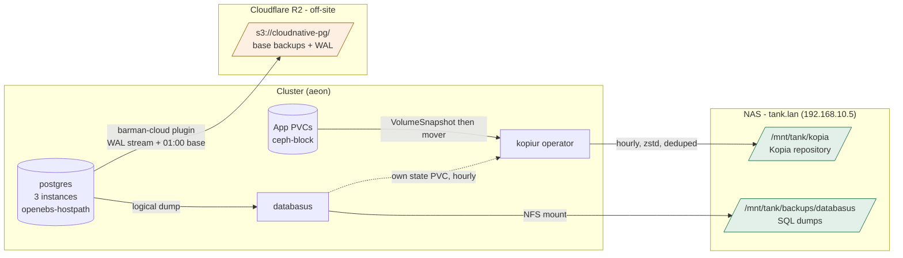

# Backups

Three independent systems, deliberately. Each covers a failure the others do not, and each writes to
a different place. Nothing here overlaps by accident.

| System | What it protects | Where it writes | Cadence | Retention |
| --- | --- | --- | --- | --- |
| CloudNativePG + barman-cloud | PostgreSQL, physically | Cloudflare R2, **off-site** | continuous WAL archive plus a daily base backup | 30 days |
| Kopiur | every app PVC, including the SQLite databases inside them | `tank.lan:/mnt/tank/kopia`, **on-site** | hourly | 3 latest, 24 hourly, 7 daily, 4 weekly |
| Databasus | PostgreSQL, logically | `tank.lan:/mnt/tank/backups/databasus`, **on-site** | as scheduled in its own UI | set in its own UI |



## PostgreSQL, physically: CloudNativePG and barman-cloud

`infrastructure/controllers/database/cloudnative-pg/cluster/`

The `postgres` cluster runs three instances on `openebs-hostpath`. Backup is the barman-cloud plugin,
not the deprecated in-tree `barmanObjectStore`, configured through an `ObjectStore` named
`cloudflare-r2`:

- destination `s3://cloudnative-pg/`, base backups gzip, WAL zstd
- credentials `AWS_ACCESS_KEY_ID` / `AWS_SECRET_ACCESS_KEY` from `cloudnative-pg-secret`, which
  External Secrets templates from the 1Password item `cloudnative-pg`
- `ScheduledBackup/postgres-backup` at `0 0 1 * * *`, which in CloudNativePG's six-field cron is
  01:00:00 daily
- 30 day retention

Because WAL is archived continuously, this gives **point-in-time recovery** to any moment inside the
retention window. The cluster is already wired to bootstrap from it: `spec.bootstrap.recovery` names
the `source` external cluster, so a rebuild recovers rather than initialises.

`postgres-immich` is a second cluster under `clusters/aeon/apps/personal/immich/db/`, writing to
`s3://cloudnative-pg/immich/` with its own daily ScheduledBackup and 30 day retention. It is dormant
while immich is commented out of `clusters/aeon/apps/personal/kustomization.yaml`.

## App PVCs: Kopiur to the NAS

`infrastructure/components/kopiur/` and `infrastructure/controllers/kopiur-system/`

One repository, `ClusterRepository/nas`: a Kopia filesystem repository on NFS at
`tank.lan:/mnt/tank/kopia`. The password lives in `kopiur-nas-secret`, templated from the 1Password
item still named `volsync-template`. `credentialProjection.allowed: true`, so a policy in any
namespace authenticates without the secret being copied into git.

An app opts in by adding `components/kopiur` to its `ks.yaml`. That one line generates four objects,
all named `${APP}`:

| Object | What it does |
| --- | --- |
| `SnapshotPolicy` | the recipe: source PVC, zstd, retention, `adoption: Adopt`, mover identity |
| `SnapshotSchedule` | `H * * * *`, hourly with jitter |
| `Restore` | volume populator, `onMissingSnapshot: Continue` so a new app starts empty rather than failing |
| `PersistentVolumeClaim` | `dataSourceRef` pointing at the Restore, so the PVC is populated from the newest snapshot when it is first created |

The policy also verifies itself: a quick verification daily at 03:00 and a deep one at 05:00 on the
first of the month.

Kopia deduplicates and compresses, so the hourly cadence is far cheaper than it sounds. The repository
is browsable read-only at `kopia.omux.io`, which mounts the same export.

### The mover identity is the thing that bites

The mover is a separate pod that reads the app's files. **Its UID has to match the UID that owns
them.** It is set explicitly per app:

```yaml
postBuild:
  substitute:
    KOPIUR_MOVER_UID: "568"
    KOPIUR_MOVER_GID: "568"
    KOPIUR_MOVER_FSGROUP: "568"
```

The default is **568**, which is what nearly every workload here runs as; `paperless` and `databasus`
override to 1000. **When adding an app, check its `runAsUser` against the default.** A mismatch is not
caught at deploy time. It passes for as long as the app's files stay world-readable, then fails the
first time it writes a `0600` file.

Do **not** switch the component to inheriting the workload's identity. That mints a *privileged*
mover for any app running as root, which Kopiur refuses unless the whole namespace opts in.

### Opting an app out

Set `KOPIUR_SUSPEND: "true"` in its `postBuild.substitute`. **Do not remove the component.** The PVC
is defined by `components/kopiur` and carries an immutable `dataSourceRef`, so dropping the component
prunes the volume rather than just stopping the backups.

A failed snapshot is silent unless someone looks:

```bash
kubectl get snapshot -A --field-selector=status.phase=Failed
```

### Two identities in one repository

VolSync wrote to this same repository before it was retired, so the repository holds both:

| Era | username | hostname | sourcePath |
| --- | --- | --- | --- |
| Kopiur | `<app>` | `<namespace>` | `/pvc/<app>` |
| VolSync | `<app>` | `<namespace>` | `/data` |

Kopiur cannot adopt the VolSync snapshots because the path is not overridable, so they sit as
`Discovered` records rather than policy snapshots. They are still restorable by naming
`source.identity` explicitly on a `Restore`.

## PostgreSQL, logically: Databasus

`infrastructure/controllers/database/databasus/`

Databasus takes scheduled logical dumps to `tank.lan:/mnt/tank/backups/databasus`, mounted with
app-template's `type: nfs`. Three constraints, all load-bearing:

- **The mount path is fixed.** Databasus writes to `/databasus-data/backups` and that is not
  configurable, so the share mounts exactly there. Mounted anywhere else it silently writes dumps to
  the PVC instead.
- **The share must be owned `65532:65532`.** Databasus chowns that directory to its own user, and the
  export maps every client to a single UID, so a mismatched owner means the chown fails and the
  container never starts.
- **It runs as root.** The image bundles PostgreSQL, manages a `postgres` and a `databasus` user and
  drops privileges with `gosu`. Hardened defaults stop it booting.

Kopiur is suspended for it (`KOPIUR_SUSPEND: "true"`). The PVC holds only `pgdata`, `instance.json`
and a log; `pgdata` is `0700` owned by `postgres` so no unprivileged mover can read it, and the dumps
that matter are on the NAS with TrueNAS owning retention. Keeping dumps off the PVC is deliberate:
compressed dumps deduplicate badly and Kopiur would re-snapshot them hourly for no gain.

**This is not the primary Postgres backup.** For the CNPG clusters it is strictly weaker than
barman-cloud: scheduled dumps, no PITR. It earns its place on the one failure barman cannot cover.
Point-in-time recovery faithfully replays logical corruption or a bad migration; a dump taken before
it does not. A `.sql` file also restores anywhere, whereas barman's output needs CloudNativePG.

The UI is at `databasus.omux.io` on `envoy-internal`. Connection credentials are entered there rather
than declared in git.

## Restoring

| Losing | Path |
| --- | --- |
| A whole Postgres cluster | CNPG bootstrap recovery from the `cloudflare-r2` ObjectStore. `spec.bootstrap.recovery` is already wired |
| A point in time in Postgres | same, plus `recoveryTarget` |
| One table, or a bad migration | the newest Databasus dump from before the change |
| An app's PVC | a Kopiur `Restore`. See the `kopiur-restore` skill for the full ordered procedure |
| Pre-cutover PVC data | the same `Restore`, with `source.identity` set to the VolSync identity above |

## What is not backed up, and known gaps

- **Dragonfly** is a cache. Nothing to protect.
- **The media, immich and Paperless NFS shares** are the NAS's own data. Protecting them is TrueNAS's
  job, not the cluster's.
- **Talos machine configuration** is not backed up by any of this. The secrets are `op://` references
  injected by `op inject` at apply time, so they live in 1Password; the templates live in git.
- **PVC data has no off-site copy.** Kopiur writes only to the NAS. If the NAS is lost, so is every
  app snapshot. R2 holds Postgres and nothing else.
- **The Kopia repository is a single copy.** Replicating or snapshotting `/mnt/tank/kopia` on the
  TrueNAS side is what closes both of the gaps above, and it sits outside this repository.
