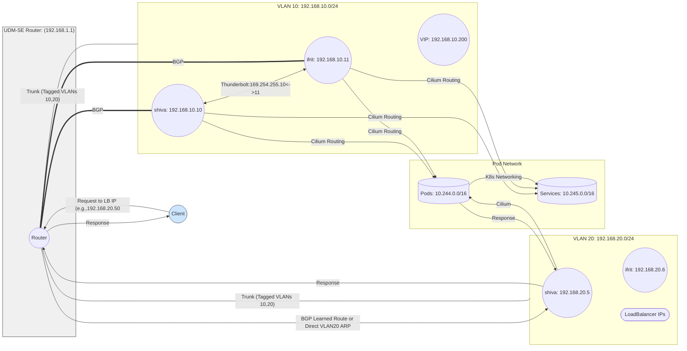

# Diagrams

Todo...

```mermaid
flowchart LR

    %% Define nodes
    subgraph UDM ["UDM-SE Router: (192.168.1.1)"]
        R((Router))
        style UDM fill:#f0f0f0,stroke:#333
    end

    subgraph VLAN10 [VLAN 10: 192.168.10.0/24]
        direction LR
        S((shiva: 192.168.10.10))
        I((ifrit: 192.168.10.11))
        VIP((VIP: 192.168.10.200))
    end

    subgraph VLAN20 [VLAN 20: 192.168.20.0/24]
        direction LR
        S2((shiva: 192.168.20.5))
        I2((ifrit: 192.168.20.6))
        LBIP([LoadBalancer IPs])
    end

    subgraph K8sPods [Pod Network]
        P[(Pods: 10.244.0.0/16)]
        SV[(Services: 10.245.0.0/16)]
    end

    %% Connections between nodes and VLANs
    R --- |"Trunk (Tagged VLANs 10,20)"| VLAN10
    R --- |"Trunk (Tagged VLANs 10,20)"| VLAN20
    VLAN10 --- S
    VLAN10 --- I
    VLAN10 --- VIP

    VLAN20 --- S2
    VLAN20 --- I2
    VLAN20 --- LBIP

    %% Internal cluster: Pod and Service networks
    S -->|Cilium Routing| P
    I -->|Cilium Routing| P
    S -->|Cilium Routing| SV
    I -->|Cilium Routing| SV
    P -->|K8s Networking| SV

    S <-->|Thunderbolt:169.254.255.10<->11| I

    %% BGP relationships
    %% The Router peers with the cluster nodes' ASN over VLAN 10 addresses.
    R === |"BGP"| S
    R === |"BGP"| I

    %% Routing logic
    %% 1. Client requests a service at a LoadBalancer IP (192.168.20.x)
    %% 2. Router sees LB IP as part of VLAN20. BGP learned route or direct ARP resolution leads traffic to a node.
    %% 3. Node uses Cilium to route to the appropriate pod/service.

    %% Arrows to show typical traffic:
    Client((Client)):::client
    Client -->|"Request to LB IP (e.g.,192.168.20.50"| R
    R -->|"BGP Learned Route or Direct VLAN20 ARP"| S2
    S2 -->|"Cilium"| P
    P -->|"Response"| S2
    S2 -->|"Response"| R -->|"Response"| Client

    classDef client fill:#cce5ff,stroke:#333
    class Client client
```
